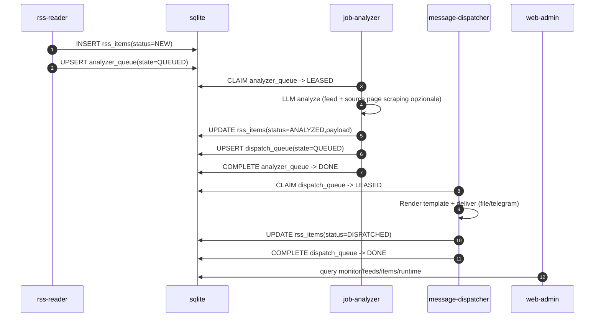
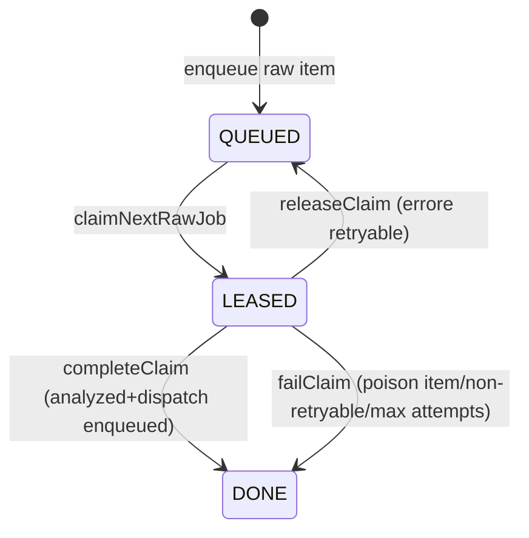
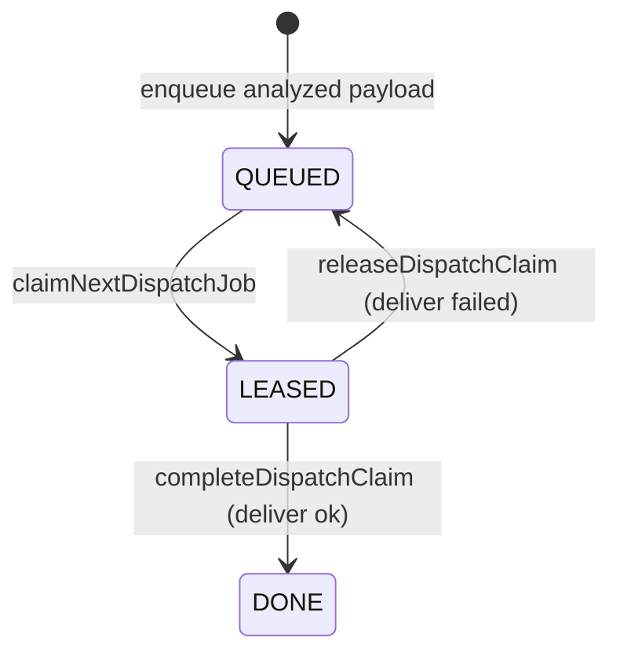
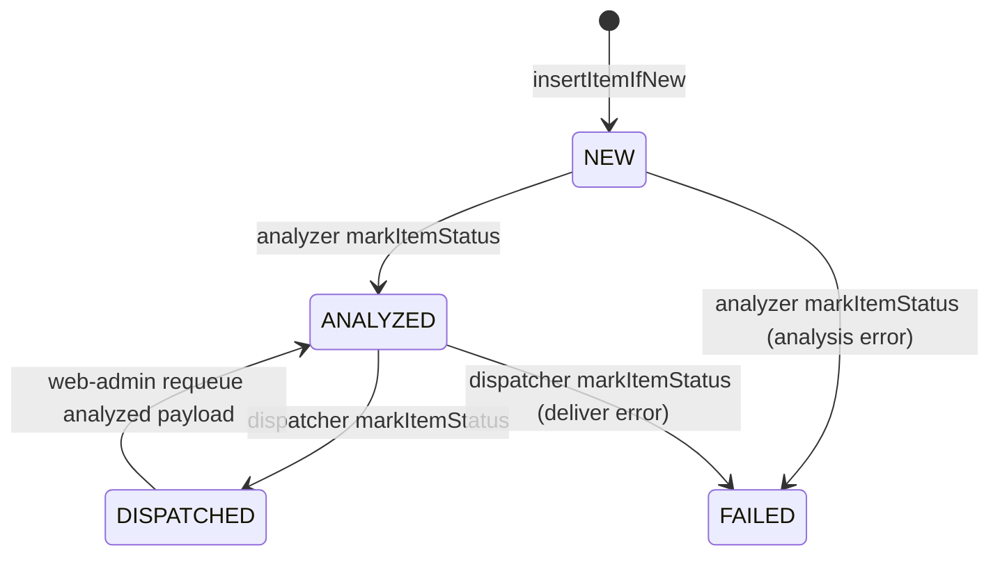
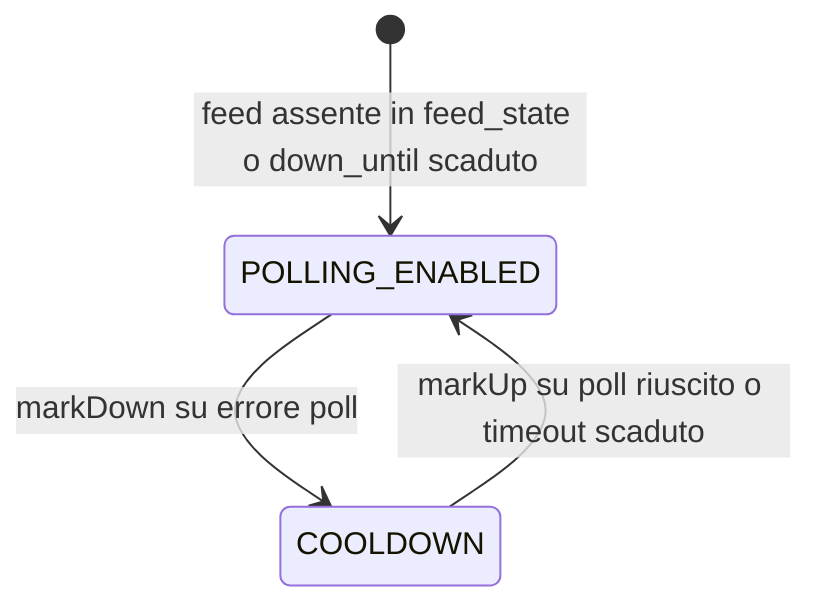
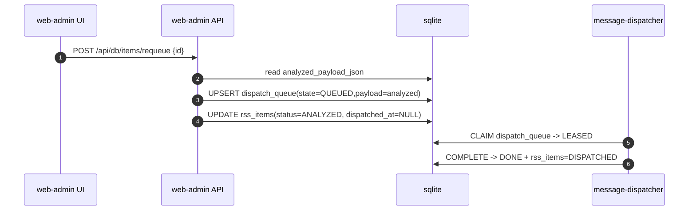

# Lifecycle e State Machine

Questo documento descrive i lifecycle implementati nel codice corrente.
La pipeline usa solo code SQLite (`analyzer_queue`, `dispatch_queue`) su DB condiviso.

## Pipeline end-to-end

## `analyzer_queue` state machine

Note implementative:
- claim con lease timeout (`lease_until`) e retry lease-expired.
- anti-stallo: `ANALYZER_MAX_DELIVERY_ATTEMPTS` + quarantena errori non-retryable (`missing required analyzed fields`).

## `dispatch_queue` state machine

## `rss_items.status` lifecycle

Note:
- `analyzed_payload_json` e `analyzed_at` vengono valorizzati in `ANALYZED`.
- `dispatched_at` viene valorizzato in `DISPATCHED`.

## Feed polling lifecycle (`feed_state`)

Dettagli:
- `markDown` imposta `failure_count=5` e `down_until=now+RSS_COOLDOWN_RETRY`.
- `markUp` resetta `failure_count=0` e `down_until=NULL`.

## Requeue lifecycle (web-admin)

