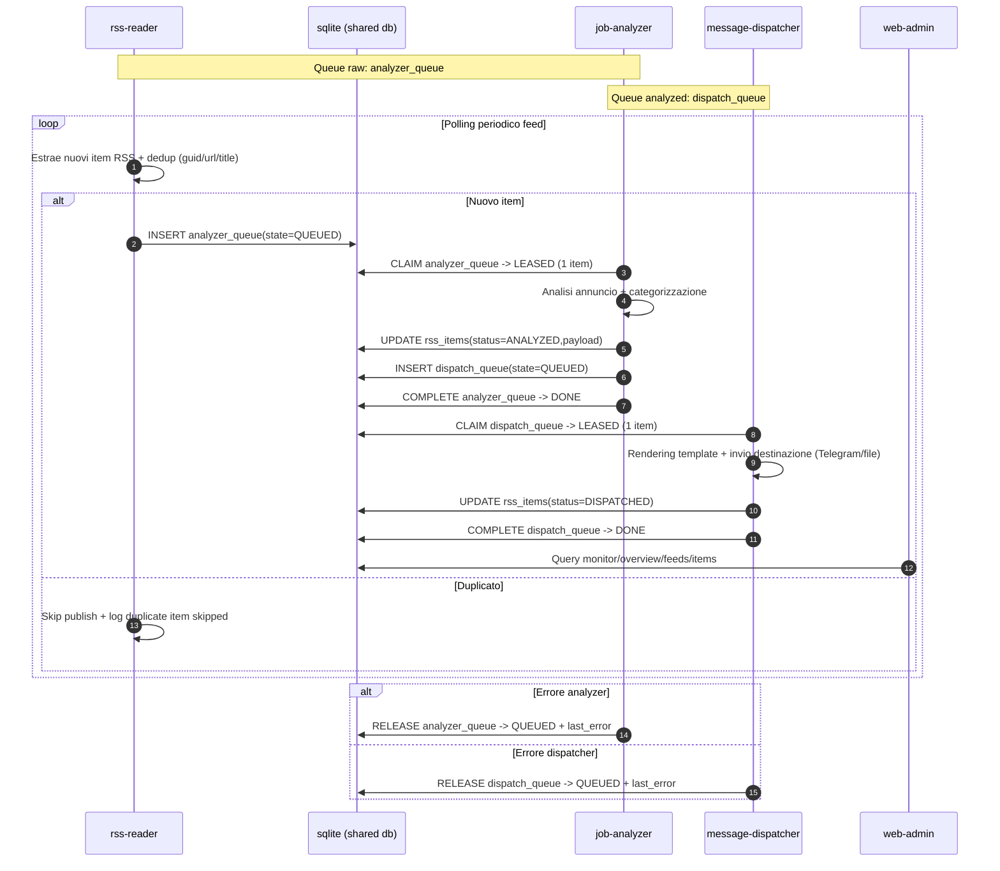

# SQLite Queue Sequence Diagram

Questo diagramma descrive la comunicazione tra i servizi via code SQLite condivise.

## Queue Tabelle

- `analyzer_queue`: coda item raw (`QUEUED`,`LEASED`,`DONE`)
- `dispatch_queue`: coda item analizzati (`QUEUED`,`LEASED`,`DONE`)
- `rss_items`: stato business (`NEW`,`ANALYZED`,`DISPATCHED`,`FAILED`) e payload/versioni
